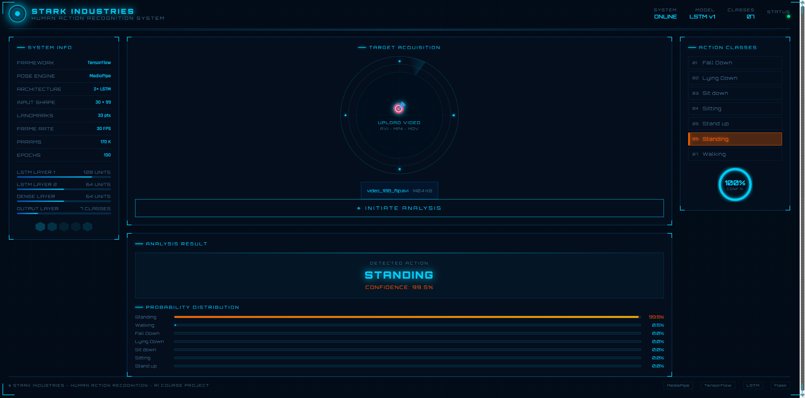
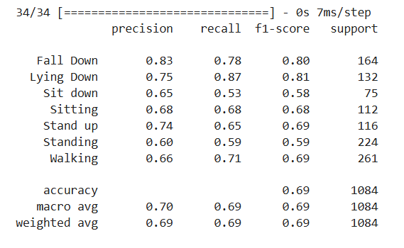
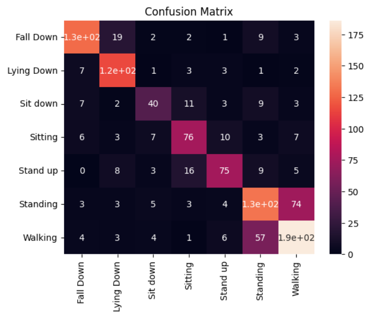
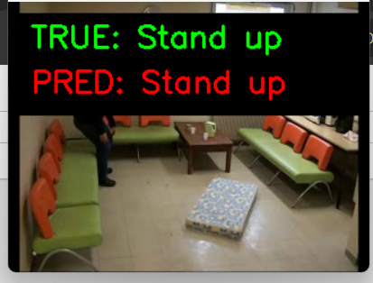

# 🤖 Human Action Recognition — STARK INDUSTRIES Edition

> Classify human body movements in short videos using **MediaPipe** pose estimation and a **two-layer LSTM** neural network — wrapped in an Iron Man-style web interface.



---

## 📌 What This Project Does

This project watches a short video (about 1 second long) and tells you what action the person in the video is doing. It can recognize **7 different actions**:

| # | Action | Description |
|---|--------|-------------|
| 1 | Fall Down | A person falling to the ground |
| 2 | Lying Down | A person lying flat on the ground |
| 3 | Sit Down | The action of sitting down |
| 4 | Sitting | A person already sitting still |
| 5 | Stand Up | The action of standing up from sitting |
| 6 | Standing | A person standing still |
| 7 | Walking | A person walking |

---

## 🧠 How It Works

The system uses a two-step approach:

**Step 1 — Pose Extraction (MediaPipe)**
Each video frame is processed by Google's MediaPipe Pose model, which finds 33 body landmarks (like shoulders, elbows, knees, etc.). For each landmark it records the (x, y, z) position, giving us **99 numbers per frame**.

**Step 2 — Sequence Classification (LSTM)**
Since each video is exactly 1 second at 30 FPS, we get a sequence of **30 frames × 99 numbers**. This sequence is fed into a two-layer LSTM (Long Short-Term Memory) neural network that learns the motion pattern over time and predicts the action class.

```
Video → MediaPipe Pose → (30 frames × 99 keypoints) → LSTM → Action Label
```

### Model Architecture

```
LSTM(128 units, return_sequences=True)
    ↓
Dropout(0.3)
    ↓
LSTM(64 units)
    ↓
Dense(64, ReLU)
    ↓
Dense(7, Softmax)  →  7 action classes
```

- **Total parameters:** 170,759
- **Training:** 200 epochs, batch size 32, Adam optimizer
- **Test accuracy:** ~69%

---

## 📁 Project Structure

```
HumanActionRecognition/
│
├── app.py                  ← Flask web server (start here!)
├── requirements.txt        ← Python packages to install
├── .gitignore
├── README.md
│
├── templates/
│   └── index.html          ← Iron Man HUD web interface
│
├── src/
│   └── predictor.py        ← MediaPipe extraction + model inference
│
├── model/
│   └── action_model.keras  ← Trained model weights
│
├── images/                 ← Screenshots and result figures
│   ├── UI.png
│   ├── classification_report.png
│   ├── confusion_matrix.png
│   ├── lying_down.png
│   └── stand_up.png
│
└── notebooks/
    └── keypoints_lab.ipynb ← Full training pipeline notebook
```

---

## 🚀 Getting Started

### 1. Clone the repository

```bash
git clone https://github.com/<your-username>/HumanActionRecognition.git
cd HumanActionRecognition
```

### 2. Create a Python 3.10 environment

> ⚠️ **Important:** Use Python 3.10 specifically. Older packages like MediaPipe 0.10.7 and TensorFlow 2.12 are not compatible with Python 3.12+.

```bash
conda create -n keypoints python=3.10 -y
conda activate keypoints
```

### 3. Install dependencies

```bash
pip install -r requirements.txt
```

### 4. Start the web server

The trained model (`action_model.keras`) is already included in the `model/` folder.

```bash
python app.py
```

Then open your browser and go to: **http://127.0.0.1:5000**

### 5. Download the dataset (only needed if you want to re-train)

The dataset is from Kaggle:
**[Dataset — Video for Human Action Recognition](https://www.kaggle.com/datasets/ngoduy/dataset-video-for-human-action-recognition)**

After downloading, make sure your folder structure looks like this:

```
data/
├── train/
│   ├── Fall Down/      *.avi
│   ├── Lying Down/     *.avi
│   ├── Sit down/       *.avi
│   ├── Sitting/        *.avi
│   ├── Stand up/       *.avi
│   ├── Standing/       *.avi
│   └── Walking/        *.avi
└── test/
    └── (same 7 folders)
```

---

## 🖥️ Web Interface

The app features an Iron Man-style HUD (Heads-Up Display) interface:

- **Upload a video** by clicking the radar circle or dragging and dropping a file
- **Click "INITIATE ANALYSIS"** to run the model
- **See the result** — predicted action class, confidence score, and a probability bar chart for all 7 classes

Supported video formats: `.avi`, `.mp4`, `.mov`, `.mkv`


---

## 📊 Results

Training was done for **200 epochs** on ~1,967 training samples (after extracting keypoints and removing all-zero frames).

### Classification Report



| Class | Precision | Recall | F1-Score | Support |
|-------|-----------|--------|----------|---------|
| Fall Down | 0.83 | 0.78 | **0.80** | 164 |
| Lying Down | 0.75 | 0.87 | **0.81** | 132 |
| Sit Down | 0.65 | 0.53 | 0.58 | 75 |
| Sitting | 0.68 | 0.68 | 0.68 | 112 |
| Stand Up | 0.74 | 0.65 | 0.69 | 116 |
| Standing | 0.60 | 0.59 | 0.59 | 224 |
| Walking | 0.66 | 0.71 | 0.69 | 261 |
| **Overall** | **0.70** | **0.69** | **0.69** | **1084** |

**Overall Test Accuracy: 69%**

The best-recognized classes are **Fall Down** (F1: 0.80) and **Lying Down** (F1: 0.81), because their body poses are very different from all others. The hardest classes are **Standing** and **Sit Down**, which are often confused with each other and with Walking.

### Confusion Matrix



The biggest source of errors is **Standing ↔ Walking** (74 Standing samples were predicted as Walking, and 57 Walking samples were predicted as Standing). This makes sense because both actions look similar in a 1-second clip — the person is upright and the difference is just foot movement.

---

## 🎥 Sample Predictions

These screenshots are taken from the `visualize_one_per_class()` function in the notebook, which plays back test videos with the true label (green) and predicted label (red) overlaid on each frame.

| Lying Down | Stand Up |
|:----------:|:--------:|
|  |  |

Both predictions are **correct** ✅. The model successfully identifies the body pose from a single 1-second clip.

---

## 🛠️ Tech Stack

| Tool | Purpose |
|------|---------|
| [MediaPipe](https://mediapipe.dev/) | Body pose landmark detection |
| [TensorFlow / Keras](https://keras.io/) | LSTM model training & inference |
| [OpenCV](https://opencv.org/) | Video reading & frame processing |
| [Flask](https://flask.palletsprojects.com/) | Web server backend |
| HTML / CSS / JavaScript | Iron Man HUD frontend |
| scikit-learn | Train/val split, metrics |

---

## ⚙️ Requirements

- Python **3.10** (required)
- Anaconda or Miniconda (recommended)
- ~2 GB of disk space for the dataset (only needed for re-training)
- A machine with at least 8 GB of RAM

---

## 📝 Notes

- The dataset contains videos at **30 FPS, 1 second long**. The code assumes this is constant and always samples exactly 30 frames.
- Some videos produce **all-zero keypoints** (MediaPipe cannot detect a person). These are automatically skipped during training and prediction.
- The model is trained on the **80% train split** and validated on a **20% validation split** carved out from the original train set. The `test/` folder is used only for final evaluation.

---
